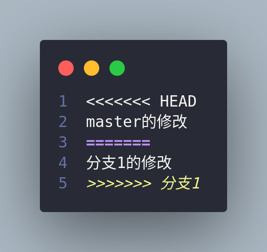

这是git操作的基本流程


> Repository,index,workspace，都存储在本地
这是git操作的基本流程


> Repository,index,workspace，都存储在本地

## 一. git的基本操作（这部分由master完成）
### git init-初始化一个本地仓库
```bash
$ git init #初始化了一个本地仓库，建立了一个.git文件夹
```
这是git init后当前文件夹的目录结构图，将仓库，暂存区和工作树（项目本地目录）都确定下来了。
```bash
githublearning
    ├── .git
    │   ├── branches
    │   ├── COMMIT_EDITMSG
    │   ├── config
    │   ├── description
    │   ├── HEAD
    │   ├── hooks
    │   ├── index
    │   ├── info
    │   ├── logs
    │   ├── objects
    │   └── refs
    ├── git学习.md
    ├── GitHub.webp
    └── README.md
```
- **工作树**：.git所在的目录，就是workplace。本例中就是githublearning文件夹，该文件夹内的内容就是需要版本控制的文件

- **暂存区**：.git下的index的文件

- **仓库**：.git文件夹就是仓库

  ​			**`HEAD`**：这是一个指向当前活动分支的引用，它告诉 Git 你当前处在哪个分支上。

  ​		**`config`**：存储仓库级别的配置信息，如用户信息、远程仓库地址等。

  ​		**`refs`**：存储分支（`refs/heads/`）、标签（`refs/tags/`）等引用。每个分支和标签都指向特定的提交对象。

  ​		**`objects`**：存储 Git 对象（提交、树、文件 blob）的数据库。Git 是通过哈希（SHA-1 值）来存储每个对象的，确保了内容的唯一性和完整性。

  ​		**`index`**：即暂存区，用于存储那些你已经用 `git add` 命令暂存的更改，准备提交时从这里取数据。

  ​		**`logs`**：保存引用的历史，记录了每个分支或引用的变更日志，便于追踪。
```bash
$ git status #记录着当前处于master还是branch分支，有无需要commit的文件等


##以下是状态
位于分支 master
要提交的变更：
  （使用 "git restore --staged <文件>..." 以取消暂存）
        修改：     "git\345\255\246\344\271\240.md"
```
### gid add-向暂存区添加文件
```bash
git add xxx.cpp #上传一个xxx.cpp文件
git add -A #上传当前文件夹下的所有文件
git add . #同上
```
### git commit-提交到本地仓库
```bash
$ git commit -m “本次提交的备注” #上传到master分支，并打上备注
$ gitgit commit #可以直接commit，之后再详细编辑备注
```
### git log-查看提交日志
查看全部日志
```bash
$ git log


##以下是日志内容
commit b3f611dafea403f51c52a04491a23e1e4e059190 (HEAD -> master)
Author: lyroom <codingfish@outlook.com>
Date:   Sat Oct 12 13:07:04 2024 +0800

    这是我的第二次详细修改
    
    xxxxxxxxxxxxxxxxxxxxxxxxxxxx

commit d1f94f3bb752ad1fc2551cd9ccb06c8eee5a39c8
Author: lyroom <codingfish@outlook.com>
Date:   Sat Oct 12 13:04:45 2024 +0800

    第一次提交

```
> 查看日志常用快捷键：和man操作，less操作基本一样
f：往后翻一页
b：往前翻一页

也可以简短一行的输出每次提交的修改
```bash
$ git log --pretty=short


##以下是日志内容
commit b3f611dafea403f51c52a04491a23e1e4e059190 (HEAD -> master)
Author: lyroom <codingfish@outlook.com>
Date:   Sat Oct 12 13:07:04 2024 +0800

    这是我的第二次详细修改

commit d1f94f3bb752ad1fc2551cd9ccb06c8eee5a39c8
Author: lyroom <codingfish@outlook.com>
Date:   Sat Oct 12 13:04:45 2024 +0800

    第一次提交

```
也可以查看文件前后修改的对比
```bash
$ git log -p README.md

##以下是对比内容
Author: lyroom <codingfish@outlook.com>
Date:   Sat Oct 12 15:33:31 2024 +0800

    这是第七次修改

diff --git a/README.md b/README.md
index 5f9894b..ffbea86 100644
--- a/README.md
+++ b/README.md
@@ -1 +1,2 @@
 第六次修改
+第七次修改
```
也可以以[图形的方式查看提交历史](#git-log-以图表的形式查看分支)
```bash
$ git log --graph
```

### git diff-查看更改前后的区别

git diff命令可以查看工作树、暂存区、仓库最新提交之间的差别。

#### 查看工作树和暂存区的区别
```bash
$ git diff
```
vscode配合gitlens插件可以清楚看到本地工作目录（左边）和暂存区（右边）的区别，红色表示删除，绿色表示新添加的内容

当然使用git diff命令也能明显的看出区别，如下,+代表添加或者修改，-代表删除内容：

这两种方法都可以看出工作树和暂存区的区别
当我git add -A后，git diff就无任何输出了

#### 查看工作树和本地仓库最新提交的差别
```bash
$ git diff HEAD
```
由于本地工作树和暂存区内容是一样的， 这个命令比较的就是仓库的最新提交和工作树的区别，比较的结果形式和上面的比较是一样的，就不贴图了

## 二. 分支操作（本部分由分支1完成）
通常一个大型的项目视需要多人合作完成的，每个人负责不同的模块和功能，这通常是并行进行的，所以我们需要分支进行，在各自的功能没有完全上线，各个分支和已经上线的程序master应互不干扰！

分支1完成后，需要与master合并

### git branch-显示所有的分支
```bash
$ git branch
* master
```
当前只有一个master分支，*指向了master分支，表示当前处于master分支下
### git checkout -b-创建切换分支
#### 创建切换分支1
创建一个名字为分支1的分支，并切换到分支1下：
```bash
$ git checkout -b 分支1
```
查看结果：
```bash
$ git branch
  master
* 分支1
```
等价操作：
```bash
git branch 分支1 #创建一个名为分支1的分支
git checkout 分支1 #切换到分支1下
```
提交修改：
```bash
git add -A
git commit -m "分支1的第一次提交"
```
#### 切换到到master分支
```bash
git checkout master #切换到主分支
```
继续查看当前文件大纲，发现**master分支的大纲**并没有分支1的这部分的文字，如下图：

而在**分支1的大纲**是这样的：


#### 切换到上一个分支
```bash
git checkout -
```
### 分支的删除
```bash
git branch -d 分支名
$ git branch -d 分支1

已删除分支 分支1（曾为 6dfa1e7）。
```
### 分支的分类
在 GitHub 或 Git 版本控制系统中，**特性分支**（feature branch）和**主干分支**（通常是 `main` 或 `master` 分支）是两种常见的分支类型，它们用于不同的开发目的：

#### 1. **主干分支（Main/Master Branch）**
- **作用**：主干分支是项目的稳定版本，通常包含可部署的代码。它是团队协作时的主分支，代表项目当前的生产环境代码。
- **特点**：
  - 代码通常是稳定的、经过测试的版本。
  - 项目的发布版本往往基于主干分支。
  - 只有当代码经过充分测试、代码审核通过后，才会合并到主干分支。

#### 2. **特性分支（Feature Branch）**
- **作用**：特性分支用于开发某个特定的功能或修复某个 bug。每个新功能、改进或问题修复通常会创建一个单独的特性分支，以便与主干分支保持隔离，确保主干分支的稳定性。
- **特点**：
  - 每个特性分支的命名通常与开发的功能相关，如 `feature/login-system` 或 `feature/add-profile-page`。
  - 开发人员可以自由地在特性分支上进行实验，而不会影响到其他开发者的工作或主干分支的稳定性。
  - 开发完成后，特性分支会通过 Pull Request 进行代码审核，测试通过后才合并到主干分支。
  流程：
1. 从主干分支拉取最新代码，创建一个新的特性分支。
2. 在特性分支上开发和测试功能。
3. 开发完成后，提交 Pull Request 以请求将特性分支的代码合并到主干分支。
4. 经过代码审核和测试，确认无问题后合并到主干分支。

这种分支模型能够帮助团队并行开发不同功能，同时确保主干分支始终保持在一个稳定的状态。
### git merge-分支的合并
#### 合并分支
分支1已经完成了当前的功能，需要与master合并
1.切换回主干分支
```bash
git checkout master
```
2.合并分支
```bash 
git merge --no-ff 分支1
```
#### 冲突解决
每次的合并并都不是一帆风顺的，如果分支修改了相同的文件，就会产生冲突，需要**手动解决冲突**
以下是合并后的报错，提示有冲突：
```bash
$ git merge --no-ff 分支1


自动合并 git学习.md
冲突（内容）：合并冲突于 git学习.md
自动合并失败，修正冲突然后提交修正的结果。
```
解决办法：
##### 1.查看合并的状态，找到冲突的文件
```bash
git status


位于分支 master
您的分支领先 'origin/master' 共 20 个提交。
  （使用 "git push" 来发布您的本地提交）

您有尚未合并的路径。
  （解决冲突并运行 "git commit"）
  （使用 "git merge --abort" 终止合并）

未合并的路径：
  （使用 "git add <文件>..." 标记解决方案）
        双方修改：   README.md

修改尚未加入提交（使用 "git add" 和/或 "git commit -a"）
```
##### 2.打开冲突的文件（README.md），解决冲突
打开文件，会发现文件中有以下的标注，如下：
```plaintext
<<<<<<< HEAD（当前分支的内容）
这是当前分支的内容
======= # 分割线，上面的是master内容，下面是分支1的内容
这是branch修改的的内容
>>>>>>> branch（传入合并分支的内容）
```

可以手动的选择要保留的内容，保留后，删除'<<<<<<< HEAD'，'======= '，'>>>>>>> branch'，等标注，保存文件即可。
##### 3.提交解决冲突后的文件
```bash
git add README.md
git commit -m "解决冲突"
```
##### 4.合并完成
```bash
git merge 分支1
```

### git log-以图表的形式查看分支
可以以图形的方式查看分支的合并情况，并且看到分支的提交记录
```bash
git log --graph


*   commit 307375175df620d5a6e9e913a0c92a61c5af91a7 (HEAD -> master)
|\  Merge: 788c7a9 c4687fb
| | Author: lyroom <codingfish@outlook.com>
| | Date:   Tue Oct 15 09:32:29 2024 +0800
| | 
| |     Merge branch '分支1'
| | 
| * commit c4687fbd37f633b82b74ad6048daf356610b4c03 (分支1)
| | Author: lyroom <codingfish@outlook.com>
| | Date:   Tue Oct 15 09:31:23 2024 +0800
| | 
| |     这是分支一的第五次修改
| | 
* | commit 788c7a90543f684b062e3b514db4adcbdd52cf99
| | Author: lyroom <codingfish@outlook.com>
| | Date:   Tue Oct 15 09:27:33 2024 +0800
| | 
| |     master merge后的第一次提交
| | 
* | commit c9cc7dcb6d5283b0dfd4fc149d067c70940a867f
| | Author: lyroom <codingfish@outlook.com>
| | Date:   Tue Oct 15 09:23:37 2024 +0800
| | 
| |     real mergegit add -A!
| | 
* | commit ac08a828e2279d605a40a6a3d674ec78b7cdf949
|\| Merge: 9c20e8d 3aa2344
| | Author: lyroom <codingfish@outlook.com>
| | Date:   Tue Oct 15 09:16:17 2024 +0800
| | 
| |     第一次合并后的提交
| | 
| * commit 3aa23441ddb6cdf4ff390d191b69850395fd2e6c
| | Author: lyroom <codingfish@outlook.com>
......
```
## 三. 更改提交的操作
### git reset-回溯历史版本
为了有助于学习，我们先回到创建分支1的时候，然后创建一个fix—B的特性分支


#### 回到分支1创建前
```bash
git reset --hard hash值 #这个hash值就是每次commit后的hash值
```
> 如果你没有做好标记寻找创建分支前的hash值的技巧：git log --graph ,找到分叉前的一个提交的hash值!，如下就是第8次修改的hash值
>
> | | Author: lyroom <codingfish@outlook.com>
>
> | | Date:   Mon Oct 14 16:59:48 2024 +0800
>
> | | 
>
> | |     master的第10次提交
>
> | | 
>
> \* | commit 7362bced26a2648153fac6779e4c5d2067eab42b
>
> |/  Author: lyroom <codingfish@outlook.com>
>
> |   Date:   Mon Oct 14 16:57:45 2024 +0800
>
> |   
>
> |       master下的第九次修改
>
> | 
>
> \* commit 61126b34e2330bad3945c616374df80de7346be1
>
> | Author: lyroom <codingfish@outlook.com>
>
> | Date:   Mon Oct 14 16:17:33 2024 +0800
>
> | 
>
> |     第8次修改
>
> | 
>
> \* commit ce7d1ccfd971bed9e79a3ececcdb67df97428692
>
> | Author: lyroom <codingfish@outlook.com>
>
> | Date:   Mon Oct 14 16:15:19 2024 +0800
### 创建分支fix-B
当前状态：

fix-B的下一个目标：


### 回溯到分支1合并后的状态
#### git  reflog-查看当前仓库的操作日志
使用git reflog查看当前仓库的操作日志，找到回溯之前的hash值
```bash
$ git reflog

d261a61 (HEAD -> 分支1) HEAD@{0}: commit: 来自分支1的修改
65f7981 HEAD@{1}: checkout: moving from fix-B to 分支1
083f020 (fix-B) HEAD@{2}: commit: 创建fix-B
61126b3 (master) HEAD@{3}: checkout: moving from master to fix-B
61126b3 (master) HEAD@{4}: checkout: moving from 分支1 to master
65f7981 HEAD@{5}: commit: 分支1的修改
3574200 HEAD@{6}: checkout: moving from master to 分支1
61126b3 (master) HEAD@{7}: reset: moving to 61126b34e2330bad3945c616374df80de7346be1
f77bdd9 HEAD@{8}: checkout: moving from 分支1 to master
```

回溯：
```bash
$ git reset --hard f77bdd9
```
目前状态如下：

合并fix-B到master:
```bash
$ git merge --no-ff fix-B
```
消除冲突后，达到最终状态：


### git commit --amend-修改最新的一次commit信息
查看git log:
```bash
commit b8c8f1ba295a524f8b85593aa2cde9c233900e61 (HEAD -> master)
Merge: ac54cd9 083f020
Author: lyroom <codingfish@outlook.com>
Date:   Tue Oct 15 13:36:28 2024 +0800

    master和fix-B冲突消除
```
上次在消除冲突后，master又commit一次，这次提交本质是无意义的，因为没有冲突，就不需要提交了，因此需要修改提交备注信息：
```bash
$ git commit --amend
```
修改提交信息为：合并master和fix-B：
```bash
commit 9441272bca5d390e54cfd05ba8b6ead3412c72b7 (HEAD -> master)
Merge: ac54cd9 083f020
Author: lyroom <codingfish@outlook.com>
Date:   Tue Oct 15 13:36:28 2024 +0800

    合并master和fix-B
```
这样就修改成功了，除了备注不一样，其他信息都一样。
### git rebase -i-修改历史提交信息
当我们提交了多次，但是发现这些提交工作树的内容都一样，或者无关紧要的好几次commit。如下：
```bash
$ git log


commit 2979c94b8b6269cfb16c01a730098d6b2ec6ad4a (HEAD -> master)
Author: lyroom <codingfish@outlook.com>
Date:   Tue Oct 15 14:02:40 2024 +0800

    又添加了几个空格,修改3次

commit d81aa63d0f933bf1b0d49cb98a197eb55eb26c55
Author: lyroom <codingfish@outlook.com>
Date:   Tue Oct 15 13:56:44 2024 +0800

    删除了几个多余字母,修改2次

commit d63d466638457b1923c83d79b908e327e5fe56e7
Author: lyroom <codingfish@outlook.com>
Date:   Tue Oct 15 13:56:03 2024 +0800

    删除了几个空格,修改1次
```
这些仅仅都是些微的修改，但是提交了多次，我们可以使用git rebase -i命令，修改合并这些提交信息。如下：  
```bash
$ git rebase -i HEAD~3 # 修改最近3次提交信息
```
合并后的commit的hash值，时间和最新的一致，但是提交信息已经修改了
```bash
$ git log


commit 2979c94b8b6269cfb16c01a730098d6b2ec6ad4a (HEAD -> master)
Author: lyroom <codingfish@outlook.com>
Date:   Tue Oct 15 14:02:40 2024 +0800

    合并备注信息
```
> 虽然'git rebase -i' 和 'git commit --amend' 都能修改commit的备注信息，但是
> 'git rebase -i' 可以合并多次提交，
> 'git commit --amend' 只能修改最近一次提交的备注信息。

## 四. 推送至远程仓库
前面的所有操作都是基于本地的操作，接下来我们要进行的是远程仓库的操作。

当然前提是你需要在github创建一个仓库，如果本地写了README.md就不要勾选创建README.md文档了

### 1. git remote add-添加远程仓库
```bash
git remote add <远程名称> <远程仓库URL> # 添加远程仓库命令格式
git remote add origin https://github.com/yourusername/your-repo.git # https方式添加仓库
```
- `<远程名称>`：为远程仓库指定的别名，常用的是 `origin`，但您可以根据需要自定义名称。
- `<远程仓库URL>`：远程仓库的实际地址。它可以是 HTTPS 或 SSH 的 URL，格式如下：
  - HTTPS: `https://github.com/user/repo.git`
  - SSH: `git@github.com:user/repo.git`

```bash
$ git remote add origin https://github.com/lyroom/githublearning.git #用户名：lyroom,仓库名字：githublearning
$ git remote -v #查看远程仓库和url

origin	https://github.com/lyroom/githublearning.git (fetch)
origin	https://github.com/lyroom/githublearning.git (push)
```


### 2.git push-推送本地仓库到远程仓库
#### 推送至远程仓库master分支

```bash
$ git push -u origin master #推送本地仓库到远程仓库 u:upstream上游的缩写，
    # -u :将oring设置为上游仓库


枚举对象中: 111, 完成.
对象计数中: 100% (111/111), 完成.
使用 20 个线程进行压缩
压缩对象中: 100% (102/102), 完成.
写入对象中: 100% (108/108), 1.18 MiB | 28.73 MiB/s, 完成.
总共 108（差异 51），复用 0（差异 0），包复用 0
remote: Resolving deltas: 100% (51/51), done.
To https://github.com/lyroom/githublearning.git
   e362a53..99a3c4e  master -> master
分支 'master' 设置为跟踪来自 'origin' 的远程分支 'master'。
```
#### 推送至远程仓库master以外分支
```bash
$ git checkout fix-B #切换到fix-B分支
$ git push -u origin  fix-B #推送本地分支fix-B到远程仓库
```


### 3.git clone-克隆远程仓库到本地
#### 获取远程仓库（master）
  首先我们切换到其他目录下
```bash
$ git clone https://github.com/lyroom/githublearning.git #克隆远程仓库到本地


正克隆到 'githublearning'...
remote: Enumerating objects: 132, done.
remote: Counting objects: 100% (132/132), done.
remote: Compressing objects: 100% (62/62), done.
remote: Total 132 (delta 58), reused 131 (delta 57), pack-reused 0 (from 0)
接收对象中: 100% (132/132), 1.18 MiB | 3.06 MiB/s, 完成.
处理 delta 中: 100% (58/58), 完成.
```
执行完成之后我们默认处于master分支下，并且和远程仓库master/main分支的内容是一样的
```bash
$ git branch 
* master
```
#### 获取远程仓库（非master）
##### git branch -a-查看远程分支
我们可以使用git branch -a查看远程和本地的分支
```bash
$ git branch -a
* master
  remotes/origin/HEAD -> origin/master
  remotes/origin/fix-B
  remotes/origin/master
```
可以看到本地只有master分支，远程有master和fix-B分支
> 注意：我们已经切换了文件夹(gitlearning--->githublearning)，所以之前本地仓库只上传了master和fix-B分支,不要和之前的仓库搞混了
##### git checkout -b-克隆远程仓库的fix-B分支到本地
```bash
$ git checkout -b fix-B origin/fix-B #克隆远程仓库的fix-B分支到本地
  #-b：创建分支并切换到fix-B分支
```
##### 向本地的fix-B分支提交更改
```bash
$ git commit -am "向本地的fix-B添加了内容" #向本地的fix-B分支提交更改
```
##### 推送fix-B分支到远程仓库
```bash
$ git push #推送本地的fix-B分支到远程仓库


枚举对象中: 5, 完成.
对象计数中: 100% (5/5), 完成.
使用 20 个线程进行压缩
压缩对象中: 100% (3/3), 完成.
写入对象中: 100% (3/3), 367 字节 | 367.00 KiB/s, 完成.
总共 3（差异 1），复用 0（差异 0），包复用 0
remote: Resolving deltas: 100% (1/1), completed with 1 local object.
To https://github.com/lyroom/githublearning.git
   083f020..bfde7fb  fix-B -> fix-B
```
### 3.git pull-拉取远程仓库到本地仓库

刚刚在githublearning的仓库中修改了fix-B分支的内容并且上传到了github，但是我们gitlearnging仓库中的fix-B分支并没有更新，所以我们需要拉取远程仓库的fix-B分支到本地仓库
> 注意要切换到最开始的项目目录(githublearning--->gitlearning)
```bash
$ git pull origin fix-B #拉取远程仓库的master分支到本地仓库
```