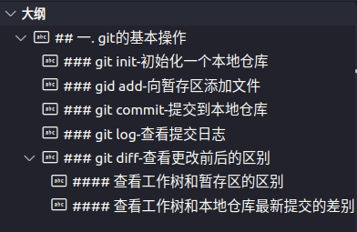

这是git操作的基本流程


> Repository,index,workspace，都存储在本地
这是git操作的基本流程


> Repository,index,workspace，都存储在本地

## 一. git的基本操作（这部分由master完成）
### git init-初始化一个本地仓库
```bash
$ git init #初始化了一个本地仓库，建立了一个.git文件夹
```
这是git init后当前文件夹的目录结构图，将仓库，暂存区和工作树（项目本地目录）都确定下来了。
```bash
githublearning
    ├── .git
    │   ├── branches
    │   ├── COMMIT_EDITMSG
    │   ├── config
    │   ├── description
    │   ├── HEAD
    │   ├── hooks
    │   ├── index
    │   ├── info
    │   ├── logs
    │   ├── objects
    │   └── refs
    ├── git学习.md
    ├── GitHub.webp
    └── README.md
```
- **工作树**：.git所在的目录，就是workplace。本例中就是githublearning文件夹，该文件夹内的内容就是需要版本控制的文件

- **暂存区**：.git下的index的文件

- **仓库**：.git文件夹就是仓库

  ​			**`HEAD`**：这是一个指向当前活动分支的引用，它告诉 Git 你当前处在哪个分支上。

  ​		**`config`**：存储仓库级别的配置信息，如用户信息、远程仓库地址等。

  ​		**`refs`**：存储分支（`refs/heads/`）、标签（`refs/tags/`）等引用。每个分支和标签都指向特定的提交对象。

  ​		**`objects`**：存储 Git 对象（提交、树、文件 blob）的数据库。Git 是通过哈希（SHA-1 值）来存储每个对象的，确保了内容的唯一性和完整性。

  ​		**`index`**：即暂存区，用于存储那些你已经用 `git add` 命令暂存的更改，准备提交时从这里取数据。

  ​		**`logs`**：保存引用的历史，记录了每个分支或引用的变更日志，便于追踪。
```bash
$ git status #记录着当前处于master还是branch分支，有无需要commit的文件等


##以下是状态
位于分支 master
要提交的变更：
  （使用 "git restore --staged <文件>..." 以取消暂存）
        修改：     "git\345\255\246\344\271\240.md"
```
### gid add-向暂存区添加文件
```bash
git add xxx.cpp #上传一个xxx.cpp文件
git add -A #上传当前文件夹下的所有文件
git add . #同上
```
### git commit-提交到本地仓库
```bash
$ git commit -m “本次提交的备注” #上传到master分支，并打上备注
$ gitgit commit #可以直接commit，之后再详细编辑备注
```
### git log-查看提交日志
查看全部日志
```bash
$ git log


##以下是日志内容
commit b3f611dafea403f51c52a04491a23e1e4e059190 (HEAD -> master)
Author: lyroom <codingfish@outlook.com>
Date:   Sat Oct 12 13:07:04 2024 +0800

    这是我的第二次详细修改
    
    xxxxxxxxxxxxxxxxxxxxxxxxxxxx

commit d1f94f3bb752ad1fc2551cd9ccb06c8eee5a39c8
Author: lyroom <codingfish@outlook.com>
Date:   Sat Oct 12 13:04:45 2024 +0800

    第一次提交

```
> 查看日志常用快捷键：和man操作，less操作基本一样
f：往后翻一页
b：往前翻一页

也可以简短一行的输出每次提交的修改
```bash
$ git log --pretty=short


##以下是日志内容
commit b3f611dafea403f51c52a04491a23e1e4e059190 (HEAD -> master)
Author: lyroom <codingfish@outlook.com>
Date:   Sat Oct 12 13:07:04 2024 +0800

    这是我的第二次详细修改

commit d1f94f3bb752ad1fc2551cd9ccb06c8eee5a39c8
Author: lyroom <codingfish@outlook.com>
Date:   Sat Oct 12 13:04:45 2024 +0800

    第一次提交

```
也可以查看文件前后修改的对比
```bash
$ git log -p README.md


##以下是对比内容
Author: lyroom <codingfish@outlook.com>
Date:   Sat Oct 12 15:33:31 2024 +0800

    这是第七次修改

diff --git a/README.md b/README.md
index 5f9894b..ffbea86 100644
--- a/README.md
+++ b/README.md
@@ -1 +1,2 @@
 第六次修改
+第七次修改
```
### git diff-查看更改前后的区别

git diff命令可以查看工作树、暂存区、仓库最新提交之间的差别。

#### 查看工作树和暂存区的区别
```bash
$ git diff
```
vscode配合gitlens插件可以清楚看到本地工作目录（左边）和暂存区（右边）的区别，红色表示删除，绿色表示新添加的内容

当然使用git diff命令也能明显的看出区别，如下,+代表添加或者修改，-代表删除内容：

这两种方法都可以看出工作树和暂存区的区别
当我git add -A后，git diff就无任何输出了

#### 查看工作树和本地仓库最新提交的差别
```bash
$ git diff HEAD
```
由于本地工作树和暂存区内容是一样的， 这个命令比较的就是仓库的最新提交和工作树的区别，比较的结果形式和上面的比较是一样的，就不贴图了

## 二. 分支操作（本部分由分支1完成）
通常一个大型的项目视需要多人合作完成的，每个人负责不同的模块和功能，这通常是并行进行的，所以我们需要分支进行，在各自的功能没有完全上线，各个分支和已经上线的程序master应互不干扰！

分支1完成后，需要与master合并

### git branch-显示所有的分支
```bash
$ git branch
* master
```
当前只有一个master分支，*指向了master分支，表示当前处于master分支下
### git checkout -b-创建切换分支
#### 创建切换分支1
创建一个名字为分支1的分支，并切换到分支1下：
```bash
$ git checkout -b 分支1
```
查看结果：
```bash
$ git branch
  master
* 分支1
```
等价操作：
```bash
git branch 分支1 #创建一个名为分支1的分支
git checkout 分支1 #切换到分支1下
```
提交修改：
```bash
git add -A
git commit -m "分支1的第一次提交"
```
#### 切换到到master分支
```bash
git checkout master #切换到主分支
```
继续查看当前文件大纲，发现**master分支的大纲**并没有分支1的这部分的文字，如下图：

而在**分支1的大纲**是这样的：


#### 切换到上一个分支
```bash
git checkout -
```
### 分支的分类
在 GitHub 或 Git 版本控制系统中，**特性分支**（feature branch）和**主干分支**（通常是 `main` 或 `master` 分支）是两种常见的分支类型，它们用于不同的开发目的：

#### 1. **主干分支（Main/Master Branch）**
- **作用**：主干分支是项目的稳定版本，通常包含可部署的代码。它是团队协作时的主分支，代表项目当前的生产环境代码。
- **特点**：
  - 代码通常是稳定的、经过测试的版本。
  - 项目的发布版本往往基于主干分支。
  - 只有当代码经过充分测试、代码审核通过后，才会合并到主干分支。

#### 2. **特性分支（Feature Branch）**
- **作用**：特性分支用于开发某个特定的功能或修复某个 bug。每个新功能、改进或问题修复通常会创建一个单独的特性分支，以便与主干分支保持隔离，确保主干分支的稳定性。
- **特点**：
  - 每个特性分支的命名通常与开发的功能相关，如 `feature/login-system` 或 `feature/add-profile-page`。
  - 开发人员可以自由地在特性分支上进行实验，而不会影响到其他开发者的工作或主干分支的稳定性。
  - 开发完成后，特性分支会通过 Pull Request 进行代码审核，测试通过后才合并到主干分支。
流程：
1. 从主干分支拉取最新代码，创建一个新的特性分支。
2. 在特性分支上开发和测试功能。
3. 开发完成后，提交 Pull Request 以请求将特性分支的代码合并到主干分支。
4. 经过代码审核和测试，确认无问题后合并到主干分支。

这种分支模型能够帮助团队并行开发不同功能，同时确保主干分支始终保持在一个稳定的状态。
### git merge-分支的合并
分支1已经完成了当前的功能，需要与master合并
1.切换回主干分支
```bash
git checkout master
```
2.合并分支
```bash 
git merge --no-ff 分支1
```
### git log-以图表的形式查看分支
```bash
git log --graph --decorate --oneline --all
```